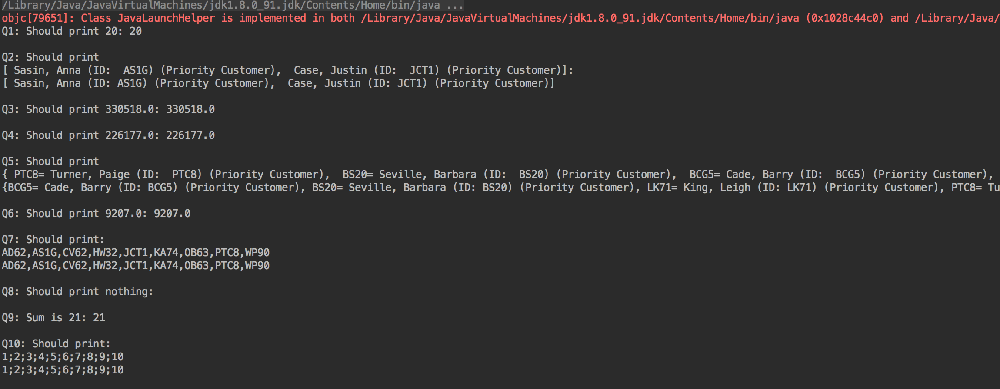
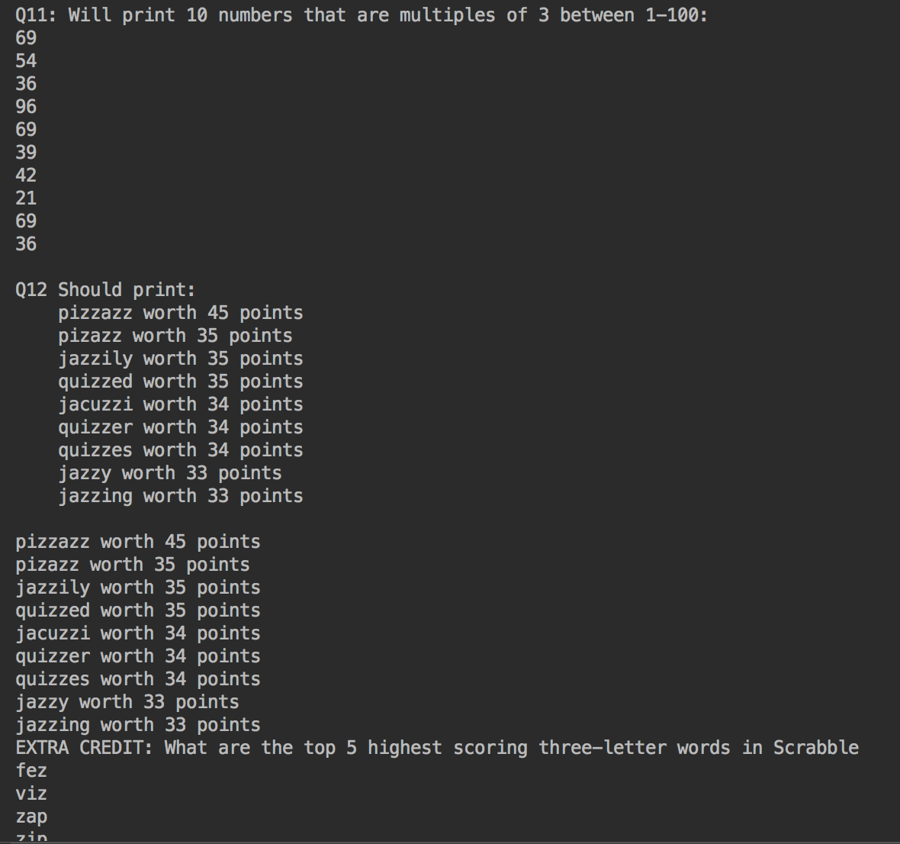

# StreamsDemo
Answer 12 questions about a collection of Customers using streams

## Requirements
- [x] Use at least one method reference somewhere in one of the 12 solutions.

## Rubric
The file uses the Customer class and the words dictionary file, which are also provided.
A Customer is described by firstName, lastName, id, state, whether they are a priority customer, and the amount of money they've spent. 
For full credit, write compact (and elegant!) solutions.
All questions can be solved in a single, pipelined statement.

### Optional Extra Credit
For 10 points extra credit, add an additional interesting query related to Customers or to the words file. Include a comment describing what you are discovering.

## Output

 

